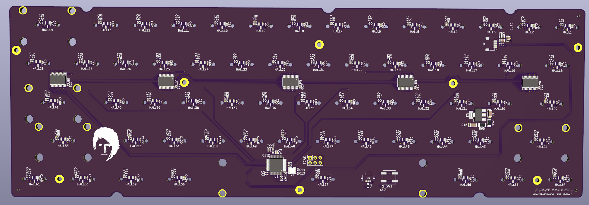
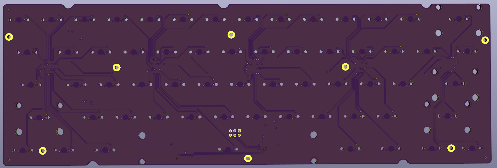

# DBOARD: 60% Hall Effect Keyboard PCB (STM32G473)

DBOARD is an open-hardware 60% mechanical keyboard PCB designed for **Hall Effect (HE) magnetic switches**. Unlike traditional contact-based PCBs, this board functions as a high-speed sensor array, utilizing continuous analog magnetic field measurements to determine key actuation.

*(Caption: Rev1 board)*

*(Caption: Rev1 board showing STM32G473 and analog multiplexer layout)*

## Key Features
* **Form Factor:** Standard 60% (GH60 compatible mounting)
* **Rapid Trigger Support:** Continuous analog scanning allows for dynamic actuation/reset points (0.1mm - 4.0mm range).
* **Architecture:** 16:1 Analog Multiplexers reduce MCU pin requirements while maintaining high scanning frequency.
* 
## Hardware Specifications

| Component | Part Number | Purpose |
| :--- | :--- | :--- |
| **Microcontroller** | STM32G473CBT6 | Core Logic, ADC, DMA, USB-C interface |
| **Multiplexers** | 74HC4067 | Multiplexing 61 analog signals to 4 ADC lines |
| **HE Sensors** | SLSS49E-3 | Linear Hall Effect sensors |
| **Power** | AMS1117-3.3 | 3.3V LDO for sensors and MCU |

## Pinout & Matrix Configuration
The board utilizes a row/col multiplexed analog matrix. The STM32 drives the Mux Select lines to cycle through active columns and reads the resulting voltage on the parallel ADC lines.

* **Mux Select Pins:** `PA9`, `PA8`, `PB14`, `PB15`
* **ADC Input Pins:** `ADC12_IN1`, `ADC12_IN2`, `ADC3_IN5`, `ADC4_IN3`

## Repository Structure
* `/hardware`: KiCad 8.0 project files (Schematics, PCB layout, Gerbers).
* `/production`: BOM and Pick & Place files for JLCPCB assembly.

## License
This project is licensed under the GNU General Public License v3.0
